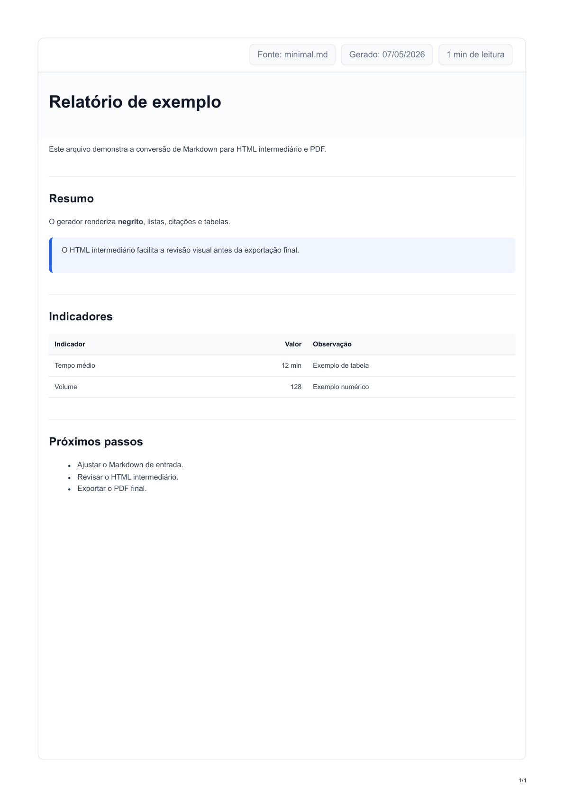
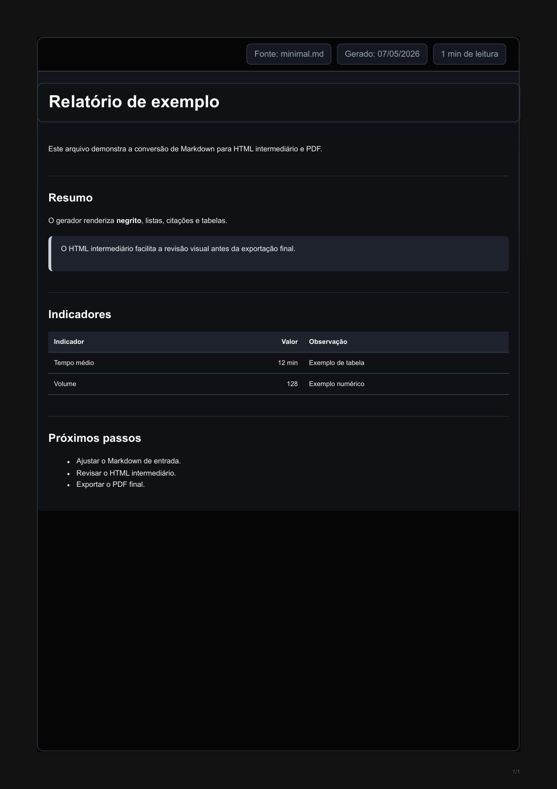

# Markdown para PDF

[](https://github.com/rod-americo/md-to-pdf/actions/workflows/ci.yml) [](https://github.com/rod-americo/md-to-pdf/releases/tag/v0.1.0)

Gerador de PDF a partir de Markdown com seleção de template por linha de comando.

## Prévia

| `whitelabel` | `blacklabel` |
| --- | --- |
|  |  |

## Requisitos

```bash npm install
```

Se a geração de PDF falhar por falta do navegador do Playwright:

```bash
npx playwright install chromium
```

## Uso

```bash npm run pdf -- whitelabel caminho/documento.md npm run pdf -- blacklabel caminho/documento.md
```

Também é possível chamar a CLI diretamente:

```bash
node src/md-to-pdf.js whitelabel caminho/documento.md
```

Por padrão, o comando gera um HTML intermediário e, em seguida, o PDF:

- `dist/<template>-<nome>.html`
- `dist/<template>-<nome>.pdf`

O HTML intermediário é útil para revisar layout, depurar estilos e ajustar o template antes da exportação final para PDF. Os diretórios `input/` e `dist/` são locais e não entram no Git.

Para testar a instalação sem gerar PDF:

```bash npm run smoke
```

Esse comando usa [examples/minimal.md](examples/minimal.md) e gera apenas HTML
em `dist/`.

Para testar a exportação completa para PDF:

```bash
npm run test:pdf
```

## Opções

- `-o, --output`: caminho do PDF de saída.
- `--html`: caminho do HTML intermediário.
- `--no-pdf`: gera apenas o HTML.
- `--list-templates`: lista os templates disponíveis.
- `-h, --help`: mostra a ajuda da CLI.

Exemplo:

```bash npm run pdf -- blacklabel caminho/documento.md --html dist/blacklabel-documento.html -o dist/blacklabel-documento.pdf
```

## Templates

- `whitelabel`: template neutro para uso genérico.
- `blacklabel`: template neutro escuro.

## Mermaid

Blocos fenced `mermaid` são renderizados como diagramas SVG antes da exportação para PDF:

````markdown

````

O runtime do Mermaid é carregado localmente a partir de `node_modules`, sem depender de CDN durante a geração.

## Templates locais

Entradas Markdown ficam fora do Git por padrão (`input/` é ignorado). Templates
privados ou experimentais podem ficar em `src/local-templates.js`. Esse arquivo
é ignorado pelo Git e deve exportar um objeto no mesmo formato dos templates
internos. Os CSS/assets correspondentes também devem permanecer fora do
versionamento.

Use [docs/local-templates.example.js](docs/local-templates.example.js) como
referência para criar esse arquivo local.

## Licença

[MIT](LICENSE.md).
